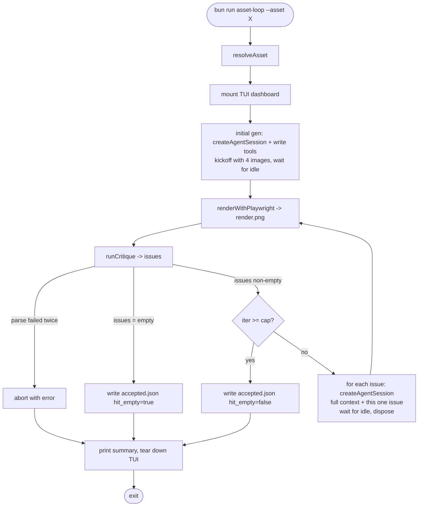

# Spec: Asset Loop TUI (Pi SDK)

## Overview

Transition the existing `apps/pi-asset-loop` Pi extension into a standalone TUI
application that uses the Pi **SDK** (`createAgentSession()`) to deterministically
orchestrate the render → critique → fix loop for MELEE asset reconstruction.

The current implementation lives at `apps/pi-asset-loop/extensions/asset-loop.ts`
and runs as a `pi -e ...` extension where the LLM is its own orchestrator —
it decides when to call `render`, when to call `critique`, and how to work
through the issue list. This trusts the model to follow a multi-step protocol
and is unreliable: critiques are sometimes skipped, issues are fixed in bulk
instead of one-by-one, and loop state lives only in the prompt.

The new implementation flips control: **TypeScript owns the loop, the LLM is
called as a tool at specific moments**. The TUI surfaces what the loop is doing
in real time (current iteration, current issue being fixed, render preview,
critique status, model usage) so the human operator can watch and intervene.

## Problem Statement

The current Pi extension–based loop has three classes of failure:

1. **Protocol drift** — the LLM sometimes writes code, then writes more code,
   instead of strictly executing render → critique → fix per turn.
2. **Bulk-fix behavior** — when the critic returns N issues, the LLM tries to
   fix them all in one editing pass instead of popping them one by one. This
   makes it impossible to attribute a regression to a specific fix.
3. **Critique gating** — the `critique` tool is occasionally skipped or called
   without a fresh render. The current `renderedSinceLastCritique` /
   `critiquedSinceLastRender` flags are guards, not enforcement of cadence.

Loop state living in the model's prompt context is the root cause. We need
loop state to live in TypeScript, with the LLM invoked surgically per phase.

## Goals

### High-Level Goals

- **Deterministic loop**: a TypeScript `for`/`while` controls iteration,
  rendering, critiquing, and issue popping. The LLM cannot skip a phase.
- **One issue per fix-step**: each critic-reported issue is a separate LLM
  invocation with focused context (the issue + current CSS/HTML), not a bulk
  prompt. A regression can be attributed to a specific fix.
- **Operator-visible TUI**: the human watching can see which iteration we're
  on, which issue is being fixed, the latest render, the critique verdict,
  token spend, and elapsed time — without reading scrollback.
- **Reuse what works**: keep `runCritique` (`src/critic.ts`),
  `renderWithPlaywright` (`src/renderer.ts`), `buildSystemPrompt`,
  `buildRenderWrapper`, `resolveAsset`, `readPngSize` as-is. Only replace the
  orchestration layer (`extensions/asset-loop.ts`).

### Mid-Level Goals

- Build a Node TUI binary (e.g. `pnpm asset-loop --asset <path>`) that takes
  the same `--asset` / `--run` flags the current extension does.
- Use Pi SDK `createAgentSession()` per loop step (initial generation, each
  fix step) rather than one long-lived session. This keeps each fix prompt
  focused and cheap.
- Render is a deterministic Playwright call from the orchestrator — not a
  tool the LLM has to choose to invoke.
- Critique is a deterministic `runCritique` call from the orchestrator —
  same.
- TUI built with the `@mariozechner/pi-tui` package (already a dependency).
  Reuses Pi's component system: `Container`, `Text`, `Box`, `SelectList`,
  themed colors. The TUI is the operator's window into the loop, not a chat
  interface.
- The loop terminates on the same conditions as today: empty issue list OR
  iteration cap. The `accept` step writes `accepted.json`.

### Detailed Goals

*To be added as conversation progresses.*

## Non-Goals

- **Not** a chat UI. The operator is not conversing with the agent — they're
  watching a deterministic pipeline run.
- **Not** abandoning the existing `src/critic.ts`, `src/renderer.ts`, etc.
  Those modules are good; only the orchestration in `extensions/asset-loop.ts`
  is being replaced.
- **Not** running multiple assets in parallel (yet). One asset per process,
  same as today.
- **Not** a replacement for Pi's interactive mode for ad-hoc work — this is
  a single-purpose pipeline binary.

## Success Criteria

- [ ] Single command launches the TUI, runs the loop end-to-end on a known
      asset, and writes `accepted.json` with the same shape the current
      extension produces.
- [ ] Each issue from a critique is observably fixed in its own LLM call
      (visible in the TUI).
- [ ] Render and critique cadence is enforced by TypeScript, not the LLM.
- [ ] All existing reusable modules (`critic.ts`, `renderer.ts`, etc.) are
      reused unchanged.
- [ ] TUI shows: current iteration, current phase, current issue, last render
      thumbnail or path, critique verdict, token usage, elapsed time.

## Context & Background

### Current Architecture

`apps/pi-asset-loop/`:
- `extensions/asset-loop.ts` — Pi extension. Registers `render`, `critique`,
  `accept` tools. Sends one kickoff `pi.sendUserMessage()` with the four
  context inputs. The LLM then loops on its own.
- `src/critic.ts` — Stateless one-shot critic via `pi-ai` `completeSimple`.
  Already orchestrator-friendly.
- `src/renderer.ts` — Playwright headless screenshot of `wrapper.html`.
- `src/systemPrompt.ts` — Builds the main agent's system prompt.
- `src/wrapper.ts` — Builds `wrapper.html` from `component.html` + `.css`.
- `src/args.ts` — Resolves `--asset`/`--run` to a `ResolvedAsset` paths bundle.

### Why Pi SDK over Pi extension

Pi extensions = TUI + chat + extension hooks. The model is the driver.
Pi SDK = `createAgentSession()` returns a programmable agent. The TypeScript
program is the driver, the agent is invoked when needed. The SDK supports
`InteractiveMode` (full TUI), `runPrintMode` (one-shot), or pure programmatic
use. For this loop we want **pure programmatic** with our own custom TUI on
top.

## Key Decisions

### Use Pi SDK rather than Pi extension
**Rationale**: Loop state should live in TypeScript, not in the model's prompt.
Extensions hand control to the LLM; SDK keeps control in our code and uses the
LLM as a tool. This eliminates protocol drift, bulk-fix behavior, and skipped
critiques.
**Made**: 2026-04-23

### One LLM session per fix-step (not one long session)
**Rationale**: Each fix prompt only needs the current files + the one issue
being fixed. Long sessions accumulate context and cost. Per-step sessions are
cheap, focused, and naturally enforce one-issue-at-a-time.
**Made**: 2026-04-23

### Reuse `src/critic.ts`, `src/renderer.ts`, `src/systemPrompt.ts`, etc.
**Rationale**: These modules are already pure functions over inputs. Only the
orchestration layer is broken. No reason to rewrite working code.
**Made**: 2026-04-23

### TUI is observe-only
**Rationale**: The operator's job is to watch the loop, not steer it. If the
loop produces a bad result, the fix is to improve the prompts/critic, not to
hand-edit mid-flight. Observe-only keeps the loop deterministic and the TUI
implementation simple — no keybinding handlers, no pause-state machine, no
approval gates. `Ctrl+C` aborts; everything else is rendering.
**Made**: 2026-04-23

### Each fix-step receives full context
**Rationale**: Source PNG, extracted PNG, current render PNG, asset.json,
extraction prompt, component.html + .css, plus the one issue. The fix agent
needs the same visual + metadata grounding the initial generator had,
otherwise it's editing CSS blind. We are not optimizing for token cost — we
are optimizing for fix quality. Per-step sessions are still cheaper than the
old long-lived session because there's no accumulating chat history.
**Made**: 2026-04-23

### Replace the extension in-place under apps/pi-asset-loop
**Rationale**: The existing `src/` modules (`critic.ts`, `renderer.ts`,
`systemPrompt.ts`, `wrapper.ts`, `args.ts`, `pngSize.ts`) are reused. Only
the orchestration surface changes. Keeping it in the same app keeps imports
short, reuses `package.json` deps (`playwright`, `@mariozechner/pi-ai`,
`@mariozechner/pi-coding-agent`, `@mariozechner/pi-tui`, `typebox`), and
avoids two coexisting "asset loop" apps confusing future readers. The
extension file (`extensions/asset-loop.ts`) gets deleted.
**Made**: 2026-04-23

### TUI status panel content
**Rationale**: The TUI exists to make the loop legible at a glance. Surface:

- **Iteration + phase + current issue** — `iter 3/15 · fixing 2/5 · [I3] major
  top_edge: tab is inverted`. The "what is happening right now" line.
- **Pending issues queue** — list view of remaining issues for the current
  critique cycle, with severity, region, one-line description. The current
  issue is highlighted; completed issues are dimmed/struck. Operator sees
  the work queue draining in real time. (Replaces a generic critique-summary
  string — pending issues is more actionable than verdict text.)
- **Token + cost meter** — cumulative input/output tokens and dollar cost
  across initial gen + all per-issue fix calls + all critique calls. Lets
  the operator see when a run is getting expensive and decide whether to
  abort. Aggregated from `Usage` on each `agent_end` event and each
  `complete` response in the critic.

Deliberately NOT included in the panel (decided by omission):
- Elapsed time + model info — useful but secondary; if needed, fits in a
  single footer line, not a top panel.
- Per-phase duration breakdown — overkill for the operator; lives in
  post-run summary if at all.
**Made**: 2026-04-23

### Print summary and exit on termination
**Rationale**: TUI tears down cleanly, terminal returns to shell, single
summary block printed to stdout: asset id, iteration count, hit-empty bool,
residual issue count + brief, accepted.json path, total cost. Operator can
re-run, scroll back, or pipe stdout. Keeping the TUI open after termination
adds a "click any key" step for no real benefit since all artifacts are on
disk.
**Made**: 2026-04-23

### Initial generation is a single SDK call with write tools
**Rationale**: The orchestrator opens an in-memory session with
`read,write,edit,bash` tools, sends a kickoff prompt containing the existing
system prompt + the four context images, and waits for `agent_end` (or
`session.agent.waitForIdle()`). The agent writes `component.html` and
`component.css`. The orchestrator then disposes the session and takes over
with deterministic render → critique → per-issue fix cycles.

Two-phase plan-then-write is unnecessary: the existing system prompt already
instructs the agent to STUDY before implementing, and a single capable model
turn handles both fine. Skipping initial gen entirely (start with empties)
turns iteration 1 into a wasted round-trip where the critic reports a hundred
defects on a blank canvas.
**Made**: 2026-04-23

### Launch via Bun script
**Rationale**: Faster cold start than node+tsx, single-binary, ESM-native,
already used elsewhere in the repo's Pi tooling (`pi-vs-cc` uses bun).
Command shape: `bun run asset-loop --asset <path>` from the app dir, or
a top-level alias if convenient. Bun also handles `.ts` natively without a
build step, matching how the current extension is loaded by Pi's jiti runtime.
**Made**: 2026-04-23

### Critic parse failure aborts the loop
**Rationale**: `runCritique` already has one built-in retry. If both attempts
fail to parse, that's a real problem — model degradation, network issue, or
prompt regression — not noise to paper over. Aborting surfaces the failure
to the operator immediately. The current synthesized-blocking-issue behavior
in `critic.ts` was a workaround for the LLM-driver model; with TS driving,
we can fail loudly. `runCritique`'s synthetic-failure path can be deleted
or kept as a return shape that the orchestrator turns into an abort.
**Made**: 2026-04-23

### Orchestrator writes accepted.json directly (no `accept` LLM tool)
**Rationale**: With TS as the driver, "accept" is just "loop terminated; write
the file". No reason to round-trip through an LLM for what is purely a state
transition. Notes are derived from final state: iteration count, hit-empty
flag, residual issues from the last critique, and a synthesized summary
("converged at iteration N" or "iteration cap reached, M residual issues").
The current extension's `accept` tool exists only because LLM-driven loops
need a way for the LLM to signal "I'm done."
**Made**: 2026-04-23

### Per-fix-step sessions are in-memory only
**Rationale**: Use `SessionManager.inMemory()` for every SDK call. Nothing
written to disk. Each fix is small and focused; if a run produces a bad
result, the artifacts that matter (component.html, component.css, render.png,
critique.json) already capture the outcome. JSONL session files would mostly
be noise. If we ever need to replay a step we can re-run the loop with the
same inputs.
**Made**: 2026-04-23

### TUI shows inline images via pi-tui Image component
**Rationale**: The whole point of an observe-only TUI is to actually see what
the loop is doing. Embedded extracted-vs-render side-by-side in the terminal
is dramatically more useful than a path the operator has to `cmd+space, open`
each iteration. Acceptable terminal requirement: Ghostty/Kitty/iTerm2/WezTerm
(all already supported by `@mariozechner/pi-tui` `Image`). Plain xterm or
Terminal.app users would have to switch terminals — that's an acceptable
constraint for this internal tool.
**Made**: 2026-04-23

### Batch fix, single verify per critique cycle
**Rationale**: Pop and fix issues one by one (each its own LLM call), then
render once + critique once at the end of the batch. This gives the model
focused attention per issue (the original problem with the extension was bulk
fixing in one prompt) while keeping the render cap meaningful — one critique
== one render. Fix-one-verify-one would burn the 15-render budget on a single
critique with 8 issues. Batch-fix-single-verify converges faster.

Trade-off accepted: regression attribution is at the per-batch level, not
per-issue. If iteration N has 5 fixes and iteration N+1 introduces a new
defect, we know it came from one of those 5 but not which. This is fine
because each fix is its own session with its own transcript — we can
investigate after the fact.
**Made**: 2026-04-23

## Open Questions

*All major questions resolved. Remaining items surface during plan/build:*

- [ ] Exact `Usage` aggregation shape — does pi-ai's `complete` return
      tokens-per-call so we can sum them, or do we instrument by hand?
- [ ] Inline image protocol fallback — what does `pi-tui` `Image` do in a
      non-supporting terminal? Acceptable to crash, or downgrade silently?
- [ ] Whether `bun run asset-loop` needs a top-level workspace alias or stays
      scoped to `apps/pi-asset-loop/` (defer to plan).
- [ ] Per-fix-step session: in-memory only, or persist for replay/debugging?
- [ ] Should we keep `accept` as an LLM-invoked tool, or have the orchestrator
      write `accepted.json` directly when terminal conditions hit?
- [ ] What should happen on critic parse failure mid-loop — retry, abort, or
      surface to operator?
- [ ] How does the TUI render the latest PNG — embedded image (Kitty/iTerm2
      protocol via `@mariozechner/pi-tui` `Image`), file path only, or both?
- [ ] Run command shape — standalone binary (`bin/asset-loop`), `pnpm script`,
      or Bun script?
- [ ] Should this still live under `apps/pi-asset-loop/`, or move to a new
      app dir to keep the old extension around for comparison?

## File Structure

```
apps/pi-asset-loop/
├── package.json                          # modified: add bun script, drop pi-extension scripts
├── bin/
│   └── asset-loop.ts                     # new: thin entry — parse argv, call orchestrator
├── extensions/
│   └── asset-loop.ts                     # DELETED (replaced by orchestrator + tui)
└── src/
    ├── orchestrator.ts                   # new: deterministic loop (initial gen, render, critique,
    │                                     #      per-issue fix, accept). Owns iteration state.
    ├── tui.ts                            # new: pi-tui dashboard — iter/phase/current issue,
    │                                     #      pending issues queue, token+cost meter, image panel
    ├── usage.ts                          # new: cumulative token/cost aggregator across SDK + critic calls
    ├── args.ts                           # unchanged: --asset/--run resolution
    ├── critic.ts                         # mostly unchanged: orchestrator handles parse-failure abort
    ├── renderer.ts                       # unchanged: Playwright screenshot
    ├── systemPrompt.ts                   # modified: simplify (LLM no longer needs loop instructions
    │                                     #           since TS owns the loop). Keep STUDY guidance for
    │                                     #           initial gen; drop tool-protocol sections.
    ├── wrapper.ts                        # unchanged
    └── pngSize.ts                        # unchanged
```

Notes:
- The orchestrator opens a new in-memory `createAgentSession()` per step
  (initial gen, each fix). No long-lived session.
- The TUI subscribes to `session.subscribe()` for the active step so the
  panel reflects token deltas / phase transitions in real time.
- `bin/asset-loop.ts` is the only entry point; bun runs it directly.

## Diagrams

### Current vs Proposed Control Flow

```ascii
CURRENT (extension)                  PROPOSED (SDK)

  pi -e asset-loop.ts                  asset-loop --asset <p>
       │                                    │
       ▼                                    ▼
  ┌──────────────┐                    ┌──────────────┐
  │  Pi runtime  │                    │ TS orchestrator│
  │ (TUI + chat) │                    │  (loop owner)  │
  └──────┬───────┘                    └──────┬─────────┘
         │ kickoff msg                       │
         ▼                                   ├─► createAgentSession()
   ┌─────────────┐                           │   "write component.html/css"
   │     LLM     │ ◄── loops on own ─┐       │   wait for idle
   │  (driver)   │                   │       │
   └─────┬───────┘                   │       ├─► renderWithPlaywright()
         │ tool calls                │       │
         ├──► render ────────────────┤       ├─► runCritique()
         ├──► critique ──────────────┤       │
         ├──► accept                 │       │ for each issue:
         │                           │       │   ├─► createAgentSession()
         └───── (may skip phases) ───┘       │   │   "fix issue X"
                                             │   │   wait for idle
                                             │   └─► next
                                             │
                                             ├─► render again, re-critique
                                             │
                                             └─► write accepted.json
```

## Notes

- All Pi SDK + extension reference docs are primed in `ai_docs/pi-agent/`.
- The Pi SDK `createAgentSession()` API and event subscription pattern from
  `examples-sdk/01-minimal.ts` and `12-full-control.ts` are directly applicable.
- `@mariozechner/pi-tui` provides `Container`, `Text`, `Box`, `SelectList`,
  `BorderedLoader`, `Image`, theming — sufficient for a status-dashboard TUI.

### Loop pseudocode (final shape)


