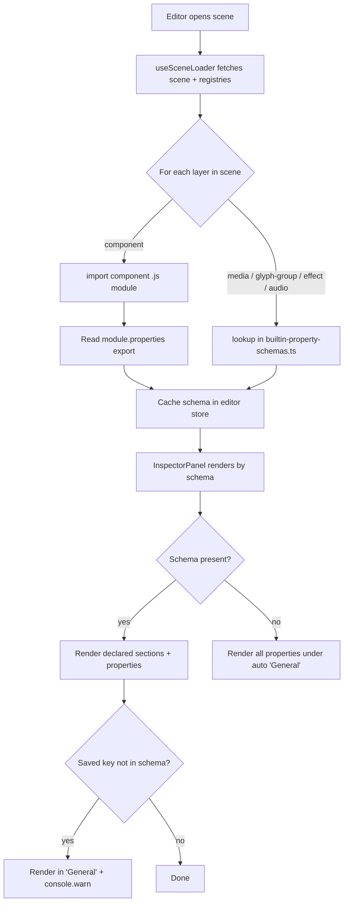

# Spec: Inspector Property Sections and Field Descriptions

**Session**: `2026-05-01_inspector-property-sections-and-field-de_ibebt8`
**Created**: 2026-05-01

## Overview

Components (and potentially other layer types) currently show their properties as a flat list in the inspector. For richer custom components — e.g. a "background sphere" with rotation, splitting location, 3D location, etc. — this becomes a soup of fields where users can't tell which property does what or how they relate. The user wants:

1. **Sections within components** — properties grouped under named headings (e.g., "Rotation", "Position", "3D"). Initially scoped to components, but conceptually extensible to other layer types.
2. **Field descriptions / tooltips** — each property field can be clicked to surface a richer popup that shows the property's full name and a description of what it does.

Direct user phrasing kept for "taste":
> "Instead of just these being laid out and everything is there and you're like, 'What is what?' you could then have sections."
> "On click, it would then kind of have a little pop-up that's like a bigger tooltip... it would tell you the full name and then the description of what it is."

## Problem Statement

*What problem are we solving? Why does it matter?*

Components in scene-engine define many properties, often with terse or technical names. The inspector renders all of them at one level, making it hard to:

- Scan and find a property
- Understand the conceptual grouping (what is "rotational" vs. "positional" vs. "render-specific")
- Know what a property actually does without reading the component source

This degrades the editor experience the more sophisticated a component becomes.

## Goals

### High-Level Goals

- Make the inspector legible for components with non-trivial property sets, by giving structure (sections) and meaning (descriptions) to each field.

### Mid-Level Goals

- Allow a component (and eventually any layer) to declare named **property sections** that group its properties.
- Allow each property to declare a **human-readable label** (full name) and a **description**, surfaced via an in-inspector popup.

### Detailed Goals

- A component's `.js` module can export a `properties` schema describing its sections and fields.
- Built-in layer types (`media`, `glyph-group`, `effect`, `audio`) have their schemas declared in `apps/scene-engine/src/lib/builtin-property-schemas.ts`.
- The inspector renders properties under sections (always sectioned model). A component without a declared schema falls into a single auto-generated "General" section.
- Sections support nesting (sections can contain subsections) and render fully expanded by default.
- Each property label is clickable to open a small floating popover containing the property's full label + plain-text description. Section labels are clickable the same way for `Section.description`.
- Property type taxonomy is locked to: `number`, `string`, `boolean`, `select`, `blend`, `fit`, `clip`, `anchor`. Each maps to one of the existing inspector input components.
- Properties render in declaration (object-literal) order within their section.
- Saved properties not present in the schema render under "General" with an inferred input AND log a dev-console warning naming the orphan.
- The editor dynamic-imports component modules on scene load to discover their `properties` exports; schemas arrive async, "General" fallback fills the gap.
- Sub-layer property forms (`SubLayerForm`, `MediaChildForm`) participate in the same sectioning + descriptions UX.
- The existing transform/layer-meta inspector area (id, position, visible, etc.) is unchanged.

## Non-Goals

- **Markdown / rich text** in descriptions — plain text only in v1.
- **Custom user-supplied React inputs** for property `type` — locked enum only; new widgets ship via the codebase, not via component modules.
- **Persisted collapse state** of sections across editor sessions — always expanded on open.
- **Re-organizing the existing transform/layer-meta inspector area** (id, position, visible) — out of scope; only the type-specific `properties` block changes.
- **Schema authoring tooling** (UI builder, validators beyond the orphan warning) — schemas are hand-authored.
- **Hover tooltips** — the affordance is explicit click, never `title=` or hover popups.
- **Side-panel / bottom-pane description display** — popover only.
- **Migration of existing scene JSON** — saved property values are unchanged; only the inspector rendering changes.

## Success Criteria

- [ ] A component module exporting a `properties` schema renders its inspector with the declared sections, in declaration order, fully expanded.
- [ ] A component with no schema export renders all of its `properties` under one auto-generated "General" section.
- [ ] Built-in layer types (`media`, `glyph-group`, `effect`, `audio`) render via schemas defined in `src/lib/builtin-property-schemas.ts`, including the existing properties (`fit`, `blend`, `opacity`, `repeat_x/y`, `scale`, `shimmer`, etc.).
- [ ] Clicking a property label opens a floating popover anchored next to it, showing the property's `label` and `description`. Clicking outside or pressing Esc dismisses it.
- [ ] Clicking a section label whose section has a `description` opens the same popover style. Clicking a section label without a description does nothing (or only toggles collapse, if implemented).
- [ ] Properties using each declared `type` (`number`, `string`, `boolean`, `select`, `blend`, `fit`, `clip`, `anchor`) render with the corresponding existing input widget (RangedInput / text input / checkbox / generic select / BlendSelect / FitSelect / ClipSelect / AnchorSelect).
- [ ] A saved property key not present in its schema renders under "General" with an input inferred from its value type, and a console warning naming the orphan and the schema source is logged.
- [ ] Sub-layer forms (`SubLayerForm`, `MediaChildForm`) render with sections and clickable labels.
- [ ] Existing transform/layer-meta fields render exactly as they do today.
- [ ] The press-start, procedural-sphere, and procedural-cylinder components each have a meaningful sectioned schema authored as part of v1 (proves the pattern end-to-end on real components).

## Context & Background

Relevant code:

- `apps/scene-engine/app/editor/_components/InspectorPanel.tsx` — top-level inspector
- `apps/scene-engine/app/editor/_components/LayerForm.tsx` — generic top-level layer property editor (currently the flat list this spec wants to restructure)
- `apps/scene-engine/app/editor/_components/SubLayerForm.tsx`, `MediaChildForm.tsx` — other property panels
- `apps/scene-engine/src/lib/inspector-config.ts` — `BLEND_MODES`, `FIT_OPTIONS`, `NUMERIC_PROPERTY_STEPS`, etc.
- `public/modules/components/` — data-driven JS components (the primary "custom property" surface)
- `public/modules/registry.json` — module entries

The renderer is imperative (vanilla JS) under `src/renderer/`; the inspector lives in React. Property metadata for sectioning + descriptions has to live somewhere that the inspector can read at edit time.

## Key Decisions

### Schema lives inside the component JS module
**Decision**: Each component's property schema is declared inside its `.js` module (alongside the render code), as a nested JSON-like structure. Authors can declare either top-level properties, or sections — and sections themselves carry a description and contain nested properties.

**User's exact framing**: "It's kind of like this nested JSON structure, where we're essentially extending the properties field and then also adding this ability to have these sections that properties nest with them."

**Rationale**: Metadata stays co-located with the code that uses it; one file to edit when adding a new property; no risk of registry/sidecar drift.
**Made**: 2026-05-01

### v1 scope: all layer types
**Decision**: Sections + field descriptions ship for every layer type (`component`, `media`, `glyph-group`, `effect`, `audio`) in v1, not just components.
**Rationale**: User wants consistent UX from day one rather than a piecemeal rollout. Components are the most "custom" surface but the affordance is valuable everywhere.
**Made**: 2026-05-01

### Built-in (non-component) schemas live in `src/lib/builtin-property-schemas.ts`
**Decision**: Schemas for `media`, `glyph-group`, `effect`, and `audio` layer types live in a single TypeScript file under `src/lib/`. The inspector merges these with the component-supplied schemas at edit time.
**Rationale**: These layer types don't have authored JS modules. A single source file keeps them discoverable, type-checked, and edited like any other source code — without spinning up sidecar JSON or stub modules.
**Made**: 2026-05-01

### Schema shape: always sectioned, with a catch-all "General"
**Decision**: Every schema is structured as a list of sections. Properties not assigned to any section fall into an auto-generated "General" section. Authors don't have a "flat" mode — even a single ungrouped schema renders as one "General" section.

**User's framing**: "I think we should do always sectioned, and then we just have a catch-all section where, if you just have general or something like that, you could do this."

**Rationale**: Single rendering path — no special-casing flat vs. sectioned in the inspector. Authors get out-of-the-box grouping without ceremony for trivial components, and a clear migration path: add sections later without restructuring.
**Made**: 2026-05-01

### Description popup opens by clicking the property label
**Decision**: The property's **label text** is the click target for opening the description popup. No `(i)` icon next to each field.

**User's framing**: "Click the label just because there's so many fucking things."

**Rationale**: With many properties per inspector, an info icon on every row produces visual noise. The label is the natural identifier for the field; clicking it opens a floating popover with the full name + description. Hover behavior (e.g., underline / cursor change) signals interactivity.
**Made**: 2026-05-01

### Sections are nestable
**Decision**: A section can contain child sections in addition to properties. Subsections collapse independently and indent visually.
**Rationale**: User chose nestable for richer components. Cost is collapse-state + indentation logic, but the schema definition stays a recursive nested structure.
**Made**: 2026-05-01

### All sections expanded by default; no persistence
**Decision**: Sections render fully expanded on first open. No localStorage memory of collapse state.
**Rationale**: Discoverability beats tidiness for an editor users are still learning. Persistence can be added later if collapse-everything-each-time becomes annoying.
**Made**: 2026-05-01

### Sections apply to the layer's custom `properties` block — not the existing transform/layer-meta UI
**Decision**: The sectioning + description feature scopes to the *type-specific* `properties` of a layer (the part that varies per asset type / per component). Existing transform-style fields (`id`, `position`, `visible`, etc.) stay as today's inspector renders them and are NOT part of the schema.

**User's framing**: "I think that's kind of already sectioned, with the transform and things like that. This is more for the custom properties and whatnot. We don't necessarily need sections for, let's say, the transform, other than maybe if we wanted to add position and rotation and other things like that."

**Rationale**: Smaller blast radius — only the property-grid portion of the inspector changes. Future possibility of grouping transform fields (position + rotation + …) is acknowledged but explicitly out of scope for v1.
**Made**: 2026-05-01

### Description content is plain text
**Decision**: Descriptions are plain strings. No markdown rendering in v1.
**Rationale**: Avoids a markdown dependency in the inspector and any sanitization concerns. Plain text is enough for "tell me what this property does" copy.
**Made**: 2026-05-01

### Popup style: floating popover anchored to the clicked label
**Decision**: Description popup is a small floating popover anchored next to the property/section label. Dismisses on click-away or Esc.
**Rationale**: Matches the user's mental model from their original phrasing ("a little pop-up that's like a bigger tooltip"). Sits where the user's eye is; no permanent inspector real estate consumed.
**Made**: 2026-05-01

### Section labels are clickable (same UX as property labels)
**Decision**: A section's own label is a click target that opens its `description` popup, exactly like a property label. The affordance is uniform across the inspector.
**Rationale**: One pattern to learn, one renderer to maintain. Sections without a `description` simply render a non-clickable header.
**Made**: 2026-05-01

### Sub-layer forms get the same treatment
**Decision**: `SubLayerForm` (glyph-group named sub-layers) and `MediaChildForm` (foreign media children) participate fully in sections + descriptions — their schemas come from the same source the parent uses (component module or built-in schema registry), and labels are clickable.
**Rationale**: Consistency. Sub-layers are conceptually just a nested editing context; users shouldn't switch UX models when editing one.
**Made**: 2026-05-01

### Fallback: auto-wrap into a single "General" section
**Decision**: If a layer type or component has no declared schema, its `properties` render under one auto-generated "General" section. No descriptions appear, but the section UI is consistent.
**Rationale**: One rendering path everywhere. Avoids a "legacy mode" branch in the inspector. Schema authoring becomes purely additive.
**Made**: 2026-05-01

### Property ordering within a section: declaration order
**Decision**: Properties render in the order the author wrote them in the schema (JS object insertion order). No alphabetical sort, no explicit `order` field.
**Rationale**: Author keeps control of grouping flow ("speed" next to "damping") with zero ceremony.
**Made**: 2026-05-01

### Orphan properties: render under "General" + dev console warning
**Decision**: When a saved layer carries a property key that isn't present in its schema, the inspector still renders it under the auto-generated "General" section using an input inferred from the value type, AND logs a dev-console warning naming the orphan key and the schema source.
**Rationale**: Forgiving editing (you don't lose access to old fields when a schema drifts) plus a visible authoring signal so renames/removals don't go unnoticed.
**Made**: 2026-05-01

### Type taxonomy: locked enum, no custom escape hatch
**Decision**: A property's `type` is one of a closed set in v1: `number`, `string`, `boolean`, `select` (with inline `options`), and the built-in specialized selects `blend`, `fit`, `clip`, `anchor` (which are shorthand for "select over the standard list in `inspector-config.ts`"). No `type: "custom"` with a user-supplied React component.

**User's framing**: "In terms of the properties themselves, I don't think we would have anything beyond more simple types."

**Rationale**: The locked set covers every property in the codebase today. New widgets (color picker, vec3 picker, etc.) can be added by extending the enum *when needed* — that's strictly less surface area than letting any component module ship its own React input.
**Made**: 2026-05-01

### Component schema discovery: editor dynamic-imports component modules on scene load
**Decision**: When the editor opens a scene, it `import()`s each component module referenced by the scene (same mechanism the renderer uses), reads the module's `properties` export, and caches it. Schemas arrive asynchronously; until a component's schema is loaded, the inspector renders that component's `properties` under the "General" fallback section.
**Rationale**: Symmetric with the existing renderer architecture — no new tooling, no separate build step, schemas stay co-located with their component. The async loading window is short (in practice the editor already loads scene + registry async via `useSceneLoader`).
**Made**: 2026-05-01

## Open Questions

*All major shape decisions resolved. Remaining items are for the plan phase, not the spec.*

## Confirmed Schema Shape

```ts
type PropertySchema = { sections: Section[] };

type Section = {
  id: string;
  label: string;
  description?: string;
  properties?: Record<string, PropertyDef>;
  sections?: Section[];          // nestable subsections
};

type PropertyDef =
  | { type: "number";  label: string; description?: string; min?: number; max?: number; step?: number }
  | { type: "string";  label: string; description?: string }
  | { type: "boolean"; label: string; description?: string }
  | { type: "select";  label: string; description?: string; options: string[] | { value: string; label: string }[] }
  | { type: "blend" | "fit" | "clip" | "anchor"; label: string; description?: string };
```

## File Structure

```
apps/scene-engine/
├── src/
│   ├── lib/
│   │   └── builtin-property-schemas.ts      # new — schemas for media/glyph-group/effect/audio
│   ├── types/
│   │   └── property-schema.ts               # new — PropertySchema / Section / PropertyDef types
│   └── store/
│       └── editor-store.ts                  # modified — cache of loaded component schemas
├── app/
│   └── editor/
│       └── _components/
│           ├── InspectorPanel.tsx           # modified — orchestrates schema-driven rendering
│           ├── LayerForm.tsx                # modified — renders by section
│           ├── SubLayerForm.tsx             # modified — same sectioning treatment
│           ├── MediaChildForm.tsx           # modified — same sectioning treatment
│           ├── PropertySection.tsx          # new — section header + nested properties + nested sections
│           ├── PropertyField.tsx            # new — clickable label + input dispatch by `type`
│           └── DescriptionPopover.tsx       # new — floating popover (anchored, click-away/Esc dismiss)
└── public/
    └── modules/
        └── components/
            ├── press-start/press-start.js                    # modified — adds `properties` export
            ├── procedural-sphere/procedural-sphere.js        # modified — adds `properties` export
            └── procedural-cylinder/procedural-cylinder.js    # modified — adds `properties` export
            # (orbit-press-start and procedural-cylinder-strips-mask: optional in v1)
```

Notes:
- The renderer (`src/renderer/`) and the API routes are unchanged. Schemas are an editor-only concern.
- The component modules continue to work without a `properties` export — they fall back to "General".
- `EVENT_TRIGGERS` / `EVENT_ACTIONS` and `EventsSection.tsx` are out of scope for v1; events stay rendered as today.

## Diagrams

### Schema resolution flow at editor open



### Section + property rendering structure (ASCII)

```ascii
┌ InspectorPanel ─────────────────────────────────┐
│ Layer: bg-sphere  (procedural-sphere)           │
│ ────────────────────────────────────────────    │
│ [transform / layer meta — unchanged today]      │
│   id, position, visible, ...                    │
│ ────────────────────────────────────────────    │
│ ▾ Rotation                ← clickable label     │
│     Speed   [▰▰▰▱▱▱▱▱▱]   0.40                  │
│     Axis    [Y ▾]                               │
│ ▾ 3D Position                                   │
│     X       [▰▰▰▰▱▱▱▱▱]   0.0                   │
│     Y       [▰▰▰▰▱▱▱▱▱]   0.0                   │
│     Z       [▰▰▰▰▱▱▱▱▱]   0.0                   │
│ ▾ Splitting               ← section w/ desc     │
│     Mode    [strips ▾]                          │
│     Count   [▰▰▱▱▱▱▱▱▱]   8                     │
│ ▾ General  (auto, only if orphans)              │
│     legacyFlag  [✓]                             │
└─────────────────────────────────────────────────┘

  Click "Speed" label  →  ┌────────────────────────────┐
                         │ Rotation Speed             │
                         │ Revolutions per second the │
                         │ sphere spins on its axis.  │
                         └────────────────────────────┘
                         (floating, click-away / Esc)
```

## Notes

- The user's framing centered on **components** (`public/modules/components/*`) because those are "more custom" — but they explicitly noted this could extend to other layer types.
- The "click to open a bigger tooltip" wording matters: this is **not** a hover tooltip — it's an explicit, persistent popup the user opens to learn about the field. That implies an info affordance (icon or click target) rather than `title=` attributes.
