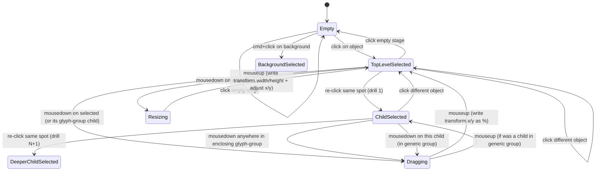

# Spec

## Overview

Add direct manipulation to the scene editor's canvas: click an object on the
stage to select it, then drag it to reposition. Clicking should also be able to
reach into nested layers (groups have children, sub-layers, foreign media —
"this could get a little bit weird for some of them"). The canvas should
remain "somewhat interactable" while editing — videos still play, effects still
animate. The flow we're optimizing for:

> "You basically just put something new on the screen, drag it to where it
> goes, and then you use the sidebar to optimize a little bit."

## Problem Statement

Today the only way to select a layer is to click it in the `HierarchyPanel`.
The user calls this "a little gross" — the hierarchy is a tree of IDs, but the
mental object is the *thing on screen*. Drop-from-asset-browser already places
new layers at the cursor position (`CanvasPanel.tsx:91-110`), but after that
moment the canvas becomes read-only: any further repositioning means hunting
through the tree and editing position fields in the inspector.

This breaks the natural authoring loop ("place → nudge → tweak") and makes the
canvas feel like a preview pane instead of a workspace.

## Goals

### High-Level Goals

- **Direct manipulation**: the canvas is the primary surface for *selecting*
  and *positioning* layers; the hierarchy and inspector become secondary
  navigation/refinement tools rather than the only way in.
- **Preserve the "live" feel**: the canvas should keep playing/animating even
  while the user clicks and drags — selection chrome must not turn the stage
  into a frozen preview.

### Mid-Level Goals

- **Click-to-select on canvas** sets `selectedPath` in the Zustand store —
  same path the hierarchy and inspector already use. No new selection state.
- **Drill-in on re-click** for nested objects (Figma-style); first click hits
  the top-level enclosing object, repeated clicks go deeper.
- **Drag to reposition** writes back to `transform.x` / `transform.y` as
  percentages. Two-tier rule: glyph-group is atomic; generic `group` lets
  children move within it.
- **8-handle resize chrome** writes back to `transform.width` / `transform.height`
  (also percentages), anchor-aware.
- **Backgrounds gated by cmd-click**, so foreground drill-in stays usable on
  scenes with full-stage backgrounds.
- **Arrow-key nudge** on the selected layer (1% step; shift-arrow = larger).
- **Locked-layer toggle** in the hierarchy that opts a layer out of canvas
  hit-testing entirely.
- **Stage stays interactable** while editing — videos still play, animations
  still run; selection chrome is overlay-only and never replaces the
  rendered content.

### Detailed Goals

*To be filled in as conversation progresses.*

## Non-Goals

- **Snap-to-center / snap-to-edge while dragging.** Considered and cut for
  v1 — the % write-back covers anchor *intent* if a user lands close to 50%
  manually; we'll see if snap is needed in practice.
- **Marquee/rubber-band multi-select.** Out — single selection only in v1.
  Even discrete shift-click multi-select is out: the current `selectedPath`
  store is single-valued.
- **Resize that re-flows internal SVG content.** Resize sets the layer's
  bounding `transform.width/height`; how the asset renderer fills that box
  (cover, contain, scale) is the renderer's existing concern, unchanged.
- **Implementing generic-`group` rendering.** Drag-children-within-group is
  defined behaviorally for when generic groups are usable, but the renderer
  for `group` is currently a stub (`group.js`); wiring up actual group
  rendering is a separate workstream.
- **Drag-and-drop reordering / re-parenting via canvas.** Hierarchy panel
  remains the place to change z-order or move things between groups.
- **Position-keyframe / animation hooks.** Drag writes a static value; we're
  not introducing a "from / to" or timeline concept here.

## Success Criteria

- [ ] Clicking a visible top-level object on the stage selects it
      (`selectedPath` updates, hierarchy + inspector follow).
- [ ] Clicking the same spot again drills into the deepest enclosing
      child (Figma-style); clicking a different spot resets to top-level.
- [ ] A fullscreen background layer is **not** selected by a plain click on
      a foreground object's empty space; **cmd-click** in the same area
      selects the background.
- [ ] Dragging a selected `glyph-group` (or any of its drilled-in children)
      moves the whole group; the JSON `transform.x` / `y` is rewritten as
      percent numbers (named `"center"` is preserved on an axis only if
      that axis didn't actually move).
- [ ] Dragging a child inside a generic `group` moves only that child
      within the parent's coordinate space (assumes generic-group rendering
      exists).
- [ ] Dragging a corner/edge handle resizes via the anchor-fixed rule:
      opposite side stays put; corner = free aspect; shift = aspect lock.
      `transform.width` / `height` are written in percent.
- [ ] Arrow keys nudge the selected layer by 1% per press; shift-arrow
      moves a larger step (TBD step size — 5% or 10%).
- [ ] A locked layer (toggled in the hierarchy) is fully un-clickable on
      the canvas, including under cmd-click.
- [ ] Hidden layers (`visible: false`) are not selectable from the canvas.
- [ ] Empty-stage click (no layer, no background hit) clears selection.
- [ ] Drop-from-asset-browser writes percent transforms (consistent with
      drag write-back).
- [ ] Selection chrome is overlay-only; videos, effects, and animations on
      the underlying stage DOM keep playing during selection, drag, and
      resize.

## Context & Background

### Current canvas behavior (`apps/scene-engine/app/editor/_components/CanvasPanel.tsx`)

- The stage is a 1440×1080 `<div ref={stageRef}>` scaled via CSS transform to
  fit the panel. Coordinates are converted via `rect.width / STAGE_W` ratios
  (already done for drop-target positioning at lines 102-105).
- The imperative renderer (`src/renderer/scene-renderer.js`) owns the DOM
  inside the stage. React wraps it as a black box — selection styling today is
  applied by toggling an `is-canvas-selected` CSS class on the resolved DOM
  element (`CanvasPanel.tsx:38-47`, via `resolveObjectEl`).
- Drag-from-asset-browser → drop-on-canvas already exists and computes a stage
  coordinate. Mouse interaction *capacity* is proven; what's missing is
  hit-testing existing layers and re-emitting drags as position updates.

### Layer model (relevant for selection nesting)

> **Schema note**: The CLAUDE.md description (uses `"layers"` and `"position"`)
> is out of date. The on-disk format and TS types use `objects` (top-level
> array), and each `SceneObject` has `transform: { x, y, width, height,
> anchor, mode }` plus `appearance`, `properties`, optional `children`.
> Numeric values in `transform.x`/`y` are interpreted as **percentages** of
> the stage. Confirmed by reading `apps/scene-engine/scenes/title/scene.json`
> and `apps/scene-engine/src/types/scene.ts:90-115`.

- Top-level: `video | image | audio | glyph-group | text | effect | component | group`
  (`SceneObject.type` union, `src/types/scene.ts:99-107`).
- `SceneObject.children` is an array of further `SceneObject`s (recursive
  same-shape), so children carry their own `transform` when present.
- A `glyph-group` semantically treats its children specially (named SVG
  sub-layer overrides + foreign media children), and we're enforcing
  "atomic for drag" on top of that. A generic `group` is a transparent
  container — its children are positionable within it. (`group.js`
  renderer is currently a stub; group rendering itself is out of scope
  here.)
- `audio` and some `effect` layers have no visible footprint and aren't
  canvas-selectable; hierarchy-only.
- `transform.x` / `y` accept the string `"center"` or numeric percent.
  `width` / `height` accept `"auto"` or numeric percent. `mode: "fill"`
  is the alternative to per-axis values (used for full-stage layers).

## Key Decisions

### Two-tier drag rule: glyph-groups are atomic, generic groups are containers
**Rationale**: User: *"Within a GlyphGroup, all children and such, we're just
going to not let them be draggable, but for general groupings (i.e., like we
have the base group object), this is where you would be able to move things
around within that group. For GlyphGroups, we are just going to make it so
that, as you click the GlyphGroup, you can only move the entire piece as the
parent."*

Two distinct group types in the schema (`SceneObject.type`), each with
different drag semantics:

- **`glyph-group`** — atomic. Click anywhere on it (including drilled-into
  child) drags the whole group. Drill-in still works for *selection* (so the
  inspector targets the child's properties), but mouse-down + drag always
  moves the parent. Honest to the SVG sub-layer model — sub-layer overrides
  have no `transform`, foreign media children are laid out by the group's
  internal grid.
- **`group`** (generic container) — children have their own `transform` in
  the group's coordinate space. Drilled-in child drags freely within the
  parent group's bounds. Standard nested-frame behavior.
**Made**: 2026-05-02
**Implications**:
- Selection drill-in works on both group types.
- Drag dispatcher needs to look at the *enclosing group type* of the
  selection: `glyph-group` ancestor → drag promotes to that ancestor;
  `group` ancestor → drag the selected child directly.
- Generic-group rendering currently a stub (`group.js`) — assumes that
  infrastructure exists by the time canvas drag for group children is
  exercised, or is added in parallel. **Out of scope for this spec.**

### Drag write-back is in percentages; named anchors are starting-state only
**Rationale**: User: *"Everything should be done position-wise in percentages,
because we are in the viewport. ... You are able to select these cut, pin
things like center, but the second you move it, it then snaps off of center
and would be going to the percentages. ... Because we are operating in web
pages, everything is percentages, not like pixels."*

The schema already encodes this: `transform.x`/`y` accept `"center"` (named
anchor) or numeric values that are interpreted as percentages of the stage
(e.g. `"y": 30` means 30% from top, confirmed by reading `scenes/title/scene.json`).
After drag, named anchors on a touched axis convert to percent numbers.
Untouched axes preserve their original value.
**Made**: 2026-05-02
**Implications**:
- Drop-from-asset-browser drop handler currently writes raw px
  (`CanvasPanel.tsx:104-105`) — likely needs to write percent numbers too,
  for consistency.
- Float precision: probably round to 2 decimal places (`33.33`) to keep JSON
  diffs readable.
- `transform.width` / `height` follow the same model — they're `"auto"` /
  `"center"` / percent numbers — so resize write-back is also in percent.

### Selection chrome: outline + 8 resize handles (full transform box)
**Rationale**: User picked the heaviest visual option even when warned about
implementation cost. The intent is to make the canvas a real workspace — drag
*and* resize as direct manipulation, not just nudge.
**Made**: 2026-05-02

### Resize: anchor-fixed (opposite side stays put), shift = aspect lock
**Rationale**: Standard Figma resize behavior. Drag right edge → left edge
stays. Drag bottom-right corner → top-left stays, free aspect by default,
**shift** locks aspect. The schema's `transform.anchor` field is preserved
unchanged across resize — it represents authoring intent, not the
moment-by-moment fixed point.
**Made**: 2026-05-02
**Implications**:
- 8 handles: 4 corners + 4 edges. Edges = single-axis resize. Corners = free
  resize, shift-locked aspect.
- During resize, the "opposite handle" of the dragged one is the
  fixed-in-stage-coordinates point. We compute that pre-drag, then derive
  new `width`/`height`/`x`/`y` so that point stays fixed.
- `width: "auto"` / `height: "auto"` convert to a concrete percent on first
  resize (measured at resize-start from the rendered bbox).
- Chrome layer (outline + handles) lives in a dedicated React-rendered
  overlay above the imperative stage DOM, with `pointer-events: none` on
  the outline and `pointer-events: auto` on each handle. Stage hit-testing
  is unaffected.

### Edge-case rules (bundled)
**Made**: 2026-05-02
- **Hidden layers (`visible: false`)** are not canvas-selectable. The
  hierarchy is the only way in. (Nothing visible to click on; no surprise
  hit-testing.)
- **Empty-stage click** (no layer hit, including no cmd-click hit on any
  background) → **deselect** (clears `selectedPath`). Standard editor
  behavior.
- **Drop-from-asset-browser** writes percentages too (currently raw px at
  `CanvasPanel.tsx:104-105`). Aligns drop and drag flows so authored JSON is
  unit-consistent. Tiny but worth doing inside this spec.
- **Locked layers** get a hierarchy treatment (faded row + lock icon, click
  to toggle) and are completely skipped by canvas hit-testing — even
  cmd-click does not reach them. Unlock from the hierarchy.

### Backgrounds require cmd-click to select
**Rationale**: Fullscreen layers like `bg-video` would otherwise capture every
canvas click and break drill-in for the foreground layers above them. Plain
clicks fall through backgrounds; cmd-click selects them. No new schema flag,
no per-scene tagging — uses an existing modifier convention. *Heuristic for
"is background" still TBD: full-stage bounds at render time, or first-in-array
position, or fit:cover.*
**Made**: 2026-05-02
**Implications**:
- Need a runtime "is background-like" predicate. Cheapest: layer's rendered
  bounding box covers the stage (≥ ~95% of 1440×1080). Avoids touching the
  scene format.
- Plain click on truly-empty area of the stage (rare in practice — usually a
  bg-video fills it) → **TBD**: deselect or no-op?

### Selection model: top-level first, drill in on re-click (Figma-style)
**Rationale**: Most authoring sessions want to grab "the logo" as a whole and
move it. Drilling into a sub-layer is a less-common but valuable secondary
gesture, and a re-click in the same spot is discoverable without modifier keys
or training. Picked over alt-click-deepens because it doesn't require the user
to remember a modifier; picked over always-deepest because it preserves the
"select the whole thing to drag it" default.
**Made**: 2026-05-02
**Implications**:
- Hit-testing must walk the full nesting (top-level layer → glyph-group
  children → SVG sub-layers + foreign media children) and remember the deepest
  hit, but return progressively deeper results on repeated clicks at the same
  point.
- Need a "drill cursor" — last hit point + last selected depth — so a click
  that lands on a *different* spot resets to top-level.
- Means the selection state machine needs slightly more memory than just
  `selectedPath` (or at least a derived helper).

## Open Questions

- [x] ~~Selection model for nested objects~~ — **decided**: top-level first,
      drill in on re-click (Figma-style).
- [ ] How are non-visual layers (audio, some effects) reached in this model —
      hierarchy-only, or do they get a placeholder gizmo on canvas?
- [ ] What units does drag write back — preserve `"center"` / `%` semantics,
      or always convert to px on first drag?
- [ ] Does empty-stage click deselect (in the rare case of no bg layer)?
- [ ] When a child is selected and the user drags inside its bounds: drag the
      parent group silently, or re-select parent on drag-start?
- [ ] How do we detect "background-like" for cmd-click gating — full-stage
      bounds at render time, fit:cover heuristic, or first-in-array?
- [ ] Multi-select / marquee — in scope or future?
- [ ] Keyboard nudging, snap-to-center, snap-to-grid — in or out?
- [ ] Locked / hidden layers — selectable from canvas?

## File Structure

Sketch — actual decomposition gets refined in plan phase.

```
apps/scene-engine/
  app/editor/_components/
    CanvasPanel.tsx                  # modified: mount overlay, route mouse events
    canvas/
      SelectionOverlay.tsx           # new: outline + 8-handle chrome layer
      useCanvasHitTest.ts            # new: pointer -> selectedPath drill-in
      useCanvasDrag.ts               # new: drag handler, % write-back
      useCanvasResize.ts             # new: handle drag -> width/height/x/y
      useCanvasKeyboardNudge.ts      # new: arrow-key 1%/shift-larger
    HierarchyRow.tsx                 # modified: lock toggle + fade-when-locked

  src/store/
    editor-store.ts                  # modified:
                                     #   - drillCursor: { lastHitPoint, depth }
                                     #   - lockedPaths: Set<string>  (or per-layer flag)
                                     #   - mutations: setTransform, setLocked

  src/lib/
    transform-units.ts               # new: px<->%, named-anchor reconciliation,
                                     #      preserve-on-untouched-axis logic
    background-detect.ts             # new: full-stage bbox heuristic
    hit-test.ts                      # new: drillable hit-test against
                                     #      data-path-tagged DOM (renderer
                                     #      tags elements; this walks them)

  src/renderer/
    scene-renderer.js                # modified: tag every rendered element
                                     #   with data-scene-path (no behavior
                                     #   change otherwise — just a hook
                                     #   for hit-test)

  src/types/scene.ts                 # modified: add `locked?: boolean` on
                                     #   SceneObject (if going with per-layer
                                     #   flag rather than store-side Set)
```

## Diagrams

### Selection state machine



### Hit-testing flow (single click)

```ascii
   pointer event on stage
            │
            ▼
  ┌────────────────────┐
  │ stage coord        │ (existing px<->% conversion)
  │ (x_pct, y_pct)     │
  └─────────┬──────────┘
            │
            ▼
  ┌────────────────────┐    same point as last hit? &&
  │ build hit-stack    │    last hit < drill-end?
  │ via data-scene-path│       │  yes
  │ DOM walk           │       ▼
  └─────────┬──────────┘    drill_depth++
            │ no
            ▼
       hit_stack[0]
       (top-level)
            │
            ▼
   filter:
     - locked? skip
     - !visible? skip
     - background-like? require cmd
            │
            ▼
   selectedPath = hit_stack[drill_depth]
```


## Notes

User's exact framing (preserved verbatim — captures the "place → drag → tweak"
mental model):

> "I would like to add the ability to click an object on the screen and then
> move it around. I can click different layers and such. This could get a
> little bit weird for some of them. I'm just kind of wanting to brainstorm
> generally how this could go. I'd still like it to be somewhat interactable
> there. You basically just put something new on the screen, drag it to where
> it goes, and then you use the sidebar to optimize a little bit. Right now
> the only way to get to a component is to click in the hierarchy, which is a
> little gross."
