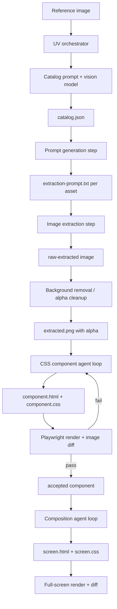

# Plan

This plan turns `SYSTEM_DESIGN.md` into an implementation path. It is intentionally part plan and part brainstorming record: the goal is to choose the smallest architecture that lets us experiment quickly without trapping the project inside one agent workflow or one image model.

## Working Thesis

Build an actual file-based processing pipeline first, then wrap it with skills and agent workflows after the vertical slice works.

Reasoning:

- A skill is good for telling Codex or another agent how to operate the system, but it is a weak source of truth for state, retries, image files, diffs, and run history.
- A UV-script pipeline gives us deterministic artifacts on disk and lets any agent resume from `runs/<screen-id>/`.
- Pi agent or Codex loops can sit on top of the scripts for judgment-heavy tasks like CSS iteration, but they should not be the only place where pipeline state exists.
- Prompt generation should be model-assisted, but prompts and structured outputs need to be versioned as files.

## Current External Assumptions

Checked against OpenAI docs on 2026-04-22:

- OpenAI image generation/editing is available through the Image API and the Responses API image generation tool.
- The current docs describe `gpt-image-2` as the latest GPT Image model.
- `gpt-image-2` does not currently support transparent backgrounds. Requests with `background: "transparent"` are not supported for that model.
- The image docs still expose `background` settings for GPT Image workflows generally, so the extraction adapter should treat transparency support as model-specific, not universal.
- Practical implication: use `gpt-image-2` for higher-fidelity extraction if it wins quality tests, then run a background removal post-process. Use a transparency-capable GPT Image model when native alpha matters more than extraction fidelity.

Sources:

- https://developers.openai.com/api/docs/guides/image-generation
- https://developers.openai.com/api/docs/guides/tools-image-generation
- https://developers.openai.com/api/reference/resources/images

## Recommended Architecture



The key distinction from `SYSTEM_DESIGN.md`: the plan inserts an explicit post-processing stage between image generation and CSS generation. That keeps us from depending on a specific model's background transparency support.

## Tooling Direction

### UV Scripts

Use standalone UV scripts at first, not a full Python package.

Suggested layout:

```text
scripts/
  catalog_screen.py
  generate_extraction_prompts.py
  extract_assets.py
  remove_background.py
  render_component.py
  diff_images.py
  run_asset_loop.py
  compose_screen.py
```

Each script should support:

- `--run runs/<screen-id>`
- `--asset asset_01` when scoped to one asset
- `--dry-run` for prompt/model-call inspection
- JSON logs or report files, not only console output
- idempotent behavior where possible

Use inline UV dependencies for early scripts. Graduate to `pyproject.toml` only when the shared code becomes annoying to duplicate.

### Mirascope / "Mirror Scope"

Assumption: "mirror scope" means Mirascope or a similar prompt/model wrapper.

Use it only as a thin adapter layer if it helps with:

- Prompt templates.
- Structured outputs.
- Swapping between Claude Opus, OpenAI, and other model providers.
- Capturing prompt inputs/outputs consistently.

Do not let the wrapper define the project architecture. The project should own its schemas, run folders, and retry semantics.

### Claude Opus

Use Claude Opus for language-heavy steps:

- Improving prompt templates.
- Generating extraction prompts from asset catalog entries.
- Reviewing asset catalogs for missing/over-granular assets.
- Producing CSS iteration instructions from diff reports.

Avoid using it as the only place where state lives. Every model request should read from and write to files under `runs/`.

### GPT Image

Use GPT Image for image extraction experiments, but keep the adapter model-agnostic.

The first adapter should support two modes:

1. Native alpha mode:
   - Request transparent output when the selected image model supports it.
   - Save the result as `raw-extracted.png`.

2. Opaque extraction mode:
   - Use the strongest available image editing model even if it returns an opaque background.
   - Save as `raw-extracted.png`.
   - Run `remove_background.py` to produce `extracted.png`.

This lets us compare "native alpha" against "best extraction + alpha cleanup" empirically.

### Background Removal

Add background removal as a pluggable post-process.

Candidate approaches:

- Local `rembg`/U2Net-style removal for cheap repeatable trials.
- Replicate-hosted background removal for stronger masks if local quality is bad.
- Segment Anything-style mask generation if the extracted object boundaries are complex.
- Simple chroma/alpha cleanup for generated outputs that use a flat temporary background.

The image extraction prompt should probably ask for the asset on a high-contrast flat background when native alpha is unavailable. That makes post-processing easier than trying to remove a complex reconstructed background.

### Pi Agent / Codex / Skills

Use agents for loops, but keep the pipeline executable without a specific agent UI.

Recommended split:

- UV scripts own mechanics: file setup, model calls, render, diff, reports.
- Pi agent or Codex owns judgment loops: "read report, edit CSS, rerender, decide next fix."
- Skills document how to operate the pipeline once the workflow stabilizes.

Do not start with a skill-only implementation. A skill can say "run these steps," but it cannot reliably replace an orchestrator, artifact layout, visual diff reports, retries, and model-call bookkeeping.

## Target Run Layout

Use the layout from `SYSTEM_DESIGN.md`, with a few additions:

```text
runs/
  <screen-id>/
    run.json
    source.png
    source-normalized.png
    catalog.json
    catalog-review.md
    assets/
      asset_01/
        asset.json
        extraction-prompt.txt
        image-request.json
        raw-extracted.png
        extracted.png
        alpha-mask.png
        component-prompt.md
        component.html
        component.css
        render.png
        diff.png
        report.json
        notes.md
    composition/
      composition-prompt.md
      screen.html
      screen.css
      render.png
      diff.png
      report.json
```

`run.json` should record:

- source image path and dimensions
- chosen model adapters
- model versions
- prompt template versions or hashes
- run status
- accepted/rejected asset ids
- timestamps

## Phases

### Phase 0: Planning And Baseline Decisions

Deliverables:

- `PLAN.md`
- `README.md` pointing to `SYSTEM_DESIGN.md`, `PLAN.md`, and `index.html`
- `.gitignore` entry for generated runs if appropriate

Decisions to make:

- Whether `runs/` is ignored by default.
- Whether source screenshots in `assets/` are source-controlled.
- Whether the first target is one asset or one full screen.

Recommended choice:

- Source-control curated source/reference images.
- Ignore bulk `runs/` output by default.
- Start with one asset, not the whole screen.

### Phase 1: File Contracts And Validation

Deliverables:

- JSON Schema or Pydantic models for:
  - `run.json`
  - `catalog.json`
  - `asset.json`
  - `report.json`
- Validation script:
  - `scripts/validate_run.py`

Why this comes early:

- Model outputs will drift.
- Agents will need stable files to inspect.
- Bad structured output should fail before it reaches image generation.

### Phase 2: Catalog Vertical Slice

Deliverables:

- `scripts/catalog_screen.py`
- A saved `runs/<screen-id>/catalog.json`
- A manual or model-assisted `catalog-review.md`

Flow:

1. Normalize the source screenshot.
2. Send it to a vision model with `apps/backend/src/melee_pipeline/pipeline/extraction/prompts/asset-catalog.md`.
3. Validate the JSON.
4. Split catalog assets into per-asset folders.
5. Write each `asset.json`.

Open question:

- Should the catalog prompt include screen state, such as selected button state, or should it ignore UI state and focus only on reusable visual regions?

Initial answer:

- Keep cataloging visual-region first. Add state metadata later.

### Phase 3: Extraction Prompt Generation

Deliverables:

- `scripts/generate_extraction_prompts.py`
- One `extraction-prompt.txt` per asset

Flow:

1. Read `asset.json`.
2. Use `apps/backend/src/melee_pipeline/pipeline/extraction/prompts/asset-extraction-prompt-generation.md`.
3. Write the exact extraction prompt to disk.
4. Optionally run a prompt review pass with Claude Opus.

Important constraint:

- The extraction prompt should include the target output size strategy.

Possible size strategies:

1. Preserve source canvas size:
   - Best for composition.
   - Wasteful for per-asset CSS work.

2. Crop tightly to bounds:
   - Best for CSS component recreation.
   - Requires storing original bounds for composition.

3. Both:
   - Save `extracted-full-canvas.png` and `extracted.png`.
   - More storage, fewer downstream compromises.

Recommended choice:

- Generate both when practical. Use tight crop for CSS asset loops and full-canvas or bounds metadata for composition.

### Phase 4: Image Extraction Experiments

Deliverables:

- `scripts/extract_assets.py`
- `scripts/remove_background.py`
- `raw-extracted.png`
- `extracted.png`
- `alpha-mask.png`

Experiment matrix:

| Strategy | Purpose | Risk |
| --- | --- | --- |
| GPT Image native alpha | Fastest if model supports transparent output | May use a less capable model than latest image model |
| GPT Image 2 opaque + background removal | Likely stronger extraction fidelity | Background removal may damage edges |
| GPT Image 2 on flat high-contrast background + cleanup | Easier post-processing | Prompt may alter colors around edges |
| Manual mask/inpaint variant | More control | More setup and less scalable |

Acceptance check:

- Asset has transparent background.
- Dimensions are recorded.
- The alpha mask does not cut off glows, borders, or soft shadows.
- Colors are close enough to source for CSS matching.

### Phase 5: Render And Diff Harness

Deliverables:

- `scripts/render_component.py`
- `scripts/diff_images.py`
- `report.json` for image comparisons

Use Playwright for rendering HTML/CSS to PNG.

Diff report should include:

- pixel mismatch percentage
- alpha mismatch percentage
- bounding-box delta
- dominant color delta
- optional SSIM/perceptual score
- notes suitable for an agent prompt

Do this before the CSS loop. Otherwise we cannot measure improvement.

### Phase 6: Single-Asset CSS Loop

Deliverables:

- `apps/backend/src/melee_pipeline/pipeline/asset_generation/prompts/css-asset-recreation.md`
- `scripts/run_asset_loop.py`
- `component.html`
- `component.css`
- accepted `report.json`

Loop:

1. Agent reads `asset.json`, `extracted.png`, and latest `report.json`.
2. Agent writes or edits `component.html` and `component.css`.
3. Script renders component to `render.png`.
4. Script diffs `render.png` against `extracted.png`.
5. Agent reads diff report and iterates.
6. Stop when threshold passes or max iterations is reached.

Important: do not require pure CSS for every pixel.

Recommended policy:

- Use CSS for geometry, gradients, borders, glows, repeated patterns, text, and layout.
- Allow raster textures only when CSS would be expensive or brittle.
- Record raster fallbacks explicitly in `report.json`.

### Phase 7: Composition Loop

Deliverables:

- `apps/backend/src/melee_pipeline/pipeline/asset_combining/prompts/screen-composition.md`
- `scripts/compose_screen.py`
- `composition/screen.html`
- `composition/screen.css`
- full-screen `report.json`

Flow:

1. Read accepted asset components.
2. Place them according to catalog bounds and z-order.
3. Render against the original screenshot dimensions.
4. Diff against source screenshot.
5. Iterate on layout, scale, z-index, and global effects.

Composition should not rewrite per-asset internals unless a component is reopened.

### Phase 8: Agent Packaging

Deliverables:

- Codex skill or local operating guide:
  - "Run a new screen extraction."
  - "Iterate one asset."
  - "Review a catalog."
  - "Compose a screen."
- Optional Pi agent harness for long-running loops.

Only do this after the first vertical slice works.

Reason:

- Skills and agent harnesses are workflow multipliers.
- If the underlying scripts are unstable, the skill just automates confusion.

## First Vertical Slice

Do this before trying to build the whole menu:

1. Pick one source screenshot from `assets/` or add a better reference screenshot.
2. Run cataloging.
3. Select one asset, probably a panel/frame rather than the full background.
4. Generate extraction prompt.
5. Extract the asset.
6. Remove/clean background.
7. Render a hand-written first CSS attempt.
8. Diff it.
9. Run one agent iteration loop.
10. Decide whether the pipeline is worth expanding.

Success looks like:

- All files for one asset exist under `runs/<screen-id>/assets/<asset-id>/`.
- The extracted asset has alpha.
- The render/diff harness works.
- At least one CSS iteration improves the score.
- The process is understandable from files alone.

## Open Questions

1. Is "mirror scope" specifically Mirascope? If yes, should we standardize around it for all model calls or only prompt-heavy structured outputs?
2. Which model should own cataloging: Claude Opus, GPT-5.4 vision, or another vision model?
3. Should extraction use the latest image model plus background removal by default, or should native alpha be the default and latest-model extraction be the fallback?
4. Do we want one run per source screenshot, or one run per target screen state?
5. Should the pipeline preserve all generated images, or prune failed attempts to keep disk usage sane?
6. Should `index.html` be treated as a baseline artifact, or should generated output live in a separate file from the start?
7. What score means "good enough" for each asset type?
8. How much should the pipeline optimize for exact Melee fidelity versus "CSS recreation that visually reads correctly"?

## Recommended Immediate Next Steps

1. Add a small `README.md`.
2. Add `schemas/` with the first Pydantic models.
3. Add `scripts/init_run.py` to create `runs/<screen-id>/` from a source image.
4. Add `scripts/render_component.py` and `scripts/diff_images.py` before any model-heavy automation.
5. Create `apps/backend/src/melee_pipeline/pipeline/asset_generation/prompts/css-asset-recreation.md`.
6. Run a manual first vertical slice with one asset before automating the full orchestration.

## Non-Goals For Now

- Building a polished web app around the pipeline.
- Fully automating every model call before the vertical slice proves out.
- Recreating every menu state at once.
- Solving animation matching before static layout matching.
- Promoting generated components into a source-controlled component library before acceptance criteria are real.
