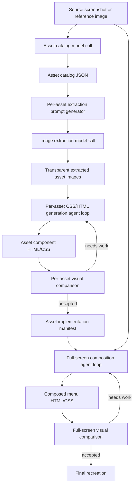
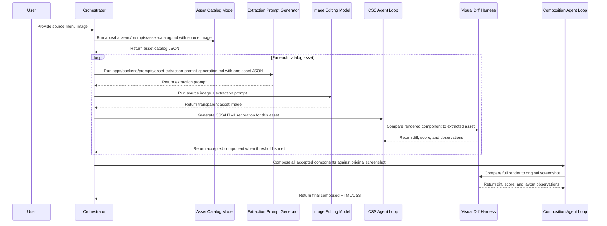

# System Design

This project aims to recreate the Super Smash Bros. Melee main menu as CSS and HTML. The target workflow is not a one-shot prompt. It is a staged pipeline that turns source screenshots into a catalog of visual assets, extracts those assets, recreates each asset as CSS/HTML, visually compares the result against the source, and then composes the parts back into a full-screen recreation.

## Goals

- Start from a real menu screenshot or reference image.
- Identify the major visual regions that need to become standalone assets.
- Extract each asset onto a transparent background.
- Generate a focused CSS/HTML recreation for each extracted asset.
- Use visual comparison loops to improve fidelity.
- Compose the generated assets into a complete menu screen.
- Keep intermediate artifacts structured enough that agents and scripts can resume work without guessing.

## Current Repository State

The repo currently has the beginnings of the pipeline, but most of the automation is still missing.

| Area | Current files | Status |
| --- | --- | --- |
| Prompting | `apps/backend/prompts/asset-catalog.md` | Defines the screen-to-asset inventory prompt and JSON shape. |
| Prompting | `apps/backend/prompts/asset-extraction-prompt-generation.md` | Defines how to turn one asset entry into an image-editing extraction prompt. |
| Prompting | `prompts/claude-design-system-prompt.md` | General HTML/design artifact prompt, not yet wired into this pipeline. |
| Reference assets | `assets/` | Contains Melee menu background loops and several thumbnail JPGs. |
| Iteration screenshots | `screenshots/` | Contains several saved prototype screenshots. |
| Prototype | `index.html` | Static CSS/HTML recreation experiment with menu shell, title screen, menu state, audio blips, tweaks, and keyboard routing. |
| Bundle | `Codecaine Standalone.html` | Self-contained bundled output of the prototype. |

There is no top-level README, build system, orchestration script, generated asset manifest, visual diff harness, or structured output storage yet.

## Target Pipeline



## Sequence View



## Core Artifacts

The pipeline should write intermediate files instead of relying on chat history.

Recommended project layout:

```text
runs/
  <screen-id>/
    source.png
    catalog.json
    assets/
      <asset-id>/
        asset.json
        extraction-prompt.txt
        extracted.png
        component.html
        component.css
        render.png
        diff.png
        report.json
    composition/
      screen.html
      screen.css
      render.png
      diff.png
      report.json
```

Backend-owned pipeline prompts live in `apps/backend/prompts/`. The new `runs/` directory holds generated artifacts and should be ignored by git if runs become large or disposable.

## Data Contracts

### Asset Catalog

`apps/backend/prompts/asset-catalog.md` already defines the first contract:

```json
{
  "image_summary": "One sentence summary.",
  "assets": [
    {
      "id": "asset_01",
      "name": "main_menu_panel",
      "type": "background | frame | panel | banner | side_element | decoration | overlay",
      "visual_description": "Pure visual description.",
      "location": "Human-readable position.",
      "bounds": "approximate [x, y, width, height]",
      "z_order": "back | mid | front | overlay",
      "extraction_hint": "What to preserve and what to remove."
    }
  ]
}
```

Needed additions:

- `source_image`: path or content-addressed id for the source screenshot.
- `screen_id`: stable id for the screen being recreated.
- `canvas`: source width, height, and target aspect ratio.
- `confidence`: model confidence per asset.
- `dependencies`: optional list of assets this asset visually depends on.

### Asset Component Report

Each CSS/HTML asset loop should produce a report like:

```json
{
  "asset_id": "asset_01",
  "component_html": "component.html",
  "component_css": "component.css",
  "render": "render.png",
  "diff": "diff.png",
  "score": 0.0,
  "threshold": 0.0,
  "accepted": false,
  "notes": [
    "Border radius is too square.",
    "Inner glow is too bright."
  ]
}
```

The exact scoring method can change, but the report should always record whether the loop accepted the result and why.

## Missing Pieces To Hook Up

### 1. Orchestrator

Missing: a script or CLI that owns the full run.

Responsibilities:

- Accept a source image path.
- Create a `runs/<screen-id>/` folder.
- Call the catalog model with `apps/backend/prompts/asset-catalog.md`.
- Validate and save `catalog.json`.
- Fan out per-asset extraction and CSS generation work.
- Track status so interrupted runs can resume.

### 2. Model Adapters

Missing: wrappers for the model calls.

Needed adapters:

- Vision structured-output call for asset cataloging.
- Text call for extraction prompt generation.
- Image editing call for transparent asset extraction.
- Coding/design agent call for per-asset CSS/HTML.
- Coding/design agent call for full-screen composition.

The prompts exist for the first two text/vision steps. The repo does not yet have executable code that calls a model or stores outputs.

### 3. Structured Output Validation

Missing: schema validation for model output.

The asset catalog prompt asks for JSON, but nothing currently enforces that the response matches the expected shape. Add JSON Schema or a typed parser before downstream steps rely on catalog fields.

### 4. Asset Extraction Storage

Missing: a canonical asset manifest and file naming convention.

After image extraction, each asset needs a durable folder with:

- Original asset JSON.
- Generated extraction prompt.
- Transparent extracted image.
- Metadata such as dimensions, transparency, model used, and timestamp.

### 5. Per-Asset CSS Agent Loop

Missing: the loop that turns one transparent image into CSS/HTML and iterates until it passes visual comparison.

Inputs:

- `extracted.png`
- `asset.json`
- design constraints
- target canvas dimensions

Outputs:

- `component.html`
- `component.css`
- `render.png`
- `diff.png`
- `report.json`

This is where `prompts/claude-design-system-prompt.md` might be adapted, but it is too broad as-is. The pipeline likely needs a narrower prompt specifically for "recreate this one asset as CSS/HTML."

### 6. Visual Comparison Harness

Missing: automated render-and-compare infrastructure.

Needed:

- Render HTML/CSS in a fixed viewport.
- Capture PNG output.
- Compare render against source or extracted asset.
- Emit a diff image and machine-readable score.
- Return localized feedback that an agent can act on.

Candidate metrics:

- Pixel difference with alpha support.
- Structural similarity for perceptual comparison.
- Edge/contour alignment for frames and panels.
- Color delta summaries for gradients and glows.

### 7. Full-Screen Composition Loop

Missing: the agent loop that lays accepted components over the original screen.

Inputs:

- Source screenshot.
- Asset catalog.
- Accepted per-asset components.
- Per-asset bounds and z-order.

Outputs:

- `composition/screen.html`
- `composition/screen.css`
- final render and diff report

This loop should mostly solve layout, layering, scale, and cross-asset interaction. It should avoid rewriting accepted component internals unless the component-level report is reopened.

### 8. Project Structure For Generated Components

Missing: a decision about whether generated components live only under `runs/` or graduate into source-controlled files.

Suggested split:

- Keep raw run artifacts in `runs/`.
- Promote accepted reusable components into a future `src/assets-css/` or `components/` directory.
- Keep final hand-authored prototype work separate from generated experiments.

### 9. Build And Test Harness

Missing: package tooling.

The current prototype is plain `index.html`. That is fine for experiments, but the automated loop will need scripts for rendering, screenshots, visual diffs, and possibly a local server.

Likely minimum:

- `package.json`
- Playwright or equivalent browser renderer
- image diff library
- `npm` scripts for render, diff, and full pipeline

### 10. Acceptance Policy

Missing: explicit thresholds for "close enough."

Define acceptance differently per layer:

- Backgrounds tolerate small gradient noise but should match dominant color, motion, and perspective.
- Frames and panels need tight silhouette, border, and corner-radius matching.
- Text should usually be recreated as CSS text, not extracted as image assets.
- Full-screen composition should prioritize global layout, z-order, and negative space.

## Open Design Decisions

1. Should generated assets be pure CSS whenever possible, or can they include raster images for textures and hard-to-recreate effects?
2. Should the source of truth be one screenshot per screen, or a set of images representing hover/selected states?
3. Should the final output be a single static HTML file like `index.html`, or a componentized app with build tooling?
4. What visual diff threshold counts as accepted for each asset type?
5. Should the composition loop own animations, or should animations be per-asset responsibilities?
6. How much manual approval should happen before assets are promoted from `runs/` into source-controlled components?

## Near-Term Implementation Plan

1. Add a `README.md` that points to this document and explains how to open the current prototype.
2. Define schemas for `catalog.json`, `asset.json`, and `report.json`.
3. Add a small orchestrator that creates `runs/<screen-id>/` from a local image and saves prompt/model outputs.
4. Add a render-and-screenshot script for a fixed viewport.
5. Add a first image-diff report, even if the scoring is basic.
6. Build one vertical slice for a single asset: catalog entry -> extraction prompt -> extracted image -> CSS component -> visual diff.
7. Only after the single-asset loop works, build the full-screen composition loop.

## Relationship To `index.html`

`index.html` is currently a hand-built prototype. It is useful as a visual target and as proof that a Melee-inspired menu can be recreated in static HTML/CSS. It is not yet part of the automated pipeline.

Possible ways to use it:

- Treat it as the first manually authored baseline.
- Mine its CSS patterns for generated component prompts.
- Compare future generated compositions against its structure.
- Eventually replace or supplement it with pipeline-generated output.
