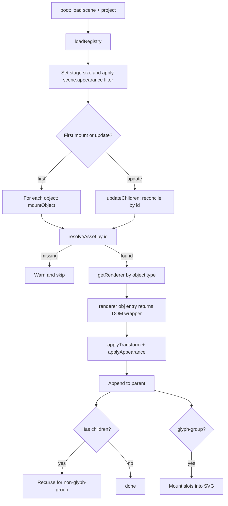

# Rendering Pipeline

Turning a scene into rendered DOM is a small, predictable pipeline: load the registry, walk `scene.objects`, dispatch each one to a per-type renderer, append the returned element, then apply the universal transform/appearance styling. The only meaningful complexity lives inside the `glyph-group` renderer, which mounts editable slots into the SVG.

The renderer is invoked twice in the editor — once to mount the scene and again on every store change to update it in place — so each step is reconciliation-aware.

---

## End-to-End Flow



## Renderer Dispatch

Renderers are registered by `type` into a small map. Each renderer is `async (object, registryEntry) => HTMLElement` and returns a wrapper element with the object's primary DOM attached.

| Type          | Renderer reads                              | Produces                                                                      |
|---------------|---------------------------------------------|--------------------------------------------------------------------------------|
| `video`       | Video file at `entry.file`                   | A `<video>` (autoplay, muted, looped) styled per `appearance`.                |
| `image`       | Image file at `entry.file`                   | An `` styled per `appearance`.                                            |
| `audio`       | Audio file at `entry.file`                   | A controller element (Web Audio playback inside).                              |
| `glyph-group` | SVG file at `entry.file`                     | A wrapper containing the parsed SVG, with slots mounted into `<foreignObject>`. |
| `effect`      | A CSS file at `entry.path`                   | A wrapper element with the stylesheet attached and properties as CSS custom props. |
| `component`   | A JS module at `entry.path`                  | Whatever the component's default export returns.                               |
| `text`        | n/a                                          | A styled text element.                                                         |
| `group`       | n/a                                          | An empty positioned wrapper (children render inside).                          |

Dispatch is by the **object's** `type`. The registry entry's `type` is expected to agree but is not re-checked here.

## Universal Styling: Transform and Appearance

After the renderer returns a wrapper, two passes apply universal styling:

### `applyTransform`

- Always sets `position: absolute`.
- If `transform.mode === "fill"`: sets `inset: 0; width: 100%; height: 100%` and applies any rotation/scale.
- Otherwise: sets `left: <x>%`, `top: <y>%`, `width`/`height` as percentages or `auto`, and a CSS `transform` chain of `translate(<anchor>) rotate(<deg>) scale(<n>)`. Anchors map to translation offsets so `(x, y)` aligns with the named anchor point on the object's box.

The CSS `transform-origin` is set to `0 0` when an anchor translation is present, so rotation/scale pivot from the anchor point — the same pivot the user sees in the editor.

### `applyAppearance`

- `opacity` → CSS `opacity`.
- `blend` → CSS `mix-blend-mode`.
- `hue` → CSS `filter: hue-rotate(<deg>)` on the wrapper.
- `fit` → CSS `object-fit` on the inner `<video>` / `` (media types only).
- `saturation` is honored on the **scene-level** `appearance` (see below); per-object saturation is merged into the same filter chain.

## Scene-Level Color Grading

Before walking `objects`, the renderer reads `scene.appearance` and writes it as a CSS `filter` on the stage root:

```js
filter: `hue-rotate(${hue}deg) saturate(${saturation})`
```

This composes with each object's per-object filter (CSS filter inheritance). It's how a single `saturation: 1.4` on the scene shifts the whole page without touching individual objects.

## Glyph Groups: Slot Mounting

The `glyph-group` renderer is the only one that does meaningful work beyond a wrapper:

1. **Fetch and parse** the SVG file referenced by the registry entry.
2. **Hide the background rect** (`<rect id="background">`), an artifact of the SVG export.
3. **Wrap** the SVG in a `<div>` sized to the SVG's `viewBox`. The wrapper's transform is applied later by `applyTransform`.
4. **For each slot in `object.slots`**:
   - Find the SVG element with `data-slot="<slot-id>"` — the anchor.
   - Render the slot's asset using the renderer for the slot's leaf type (e.g. `video-fill` → `video` renderer).
   - Wrap it in a `<foreignObject>` of viewBox dimensions, copy the anchor's `clip-path` so the fill is constrained to the letter shape, and apply the slot's `appearance`.
   - Insert the `<foreignObject>` immediately after the anchor element so it composites in the right z-order with the SVG's internal layers.

Slots replace the legacy 40-child `children` array on glyph-groups. Sub-layers that aren't tagged `data-slot` are baked: they render as authored, with no editor presence.

## Children: General Nesting

For any non-glyph-group object with `children`, the renderer recurses: each child mounts inside the parent's wrapper, with its own transform resolved against the parent's box. This produces the "moving a group moves its children" behavior — a CSS consequence of children being absolutely positioned inside a relatively-positioned ancestor.

After children are mounted, the renderer reorders the wrapper's child list to match the `children[]` array order. Z-order within `children` is array order, same rule as the top level.

## Mount vs. Update

- **First call** to `renderScene`: clears the stage root, mounts every top-level object via `mountObject`, then `reorderChildren` to match the array.
- **Subsequent calls** (editor edits): walks the stage root, builds an id-keyed map of existing wrappers, and runs `updateChildren`:
  - Wrappers whose ids are no longer in the new `objects` array are removed.
  - For each object in the new array: if a wrapper exists, re-apply transform/appearance and recurse into children. If not, `mountObject` it.
  - For `component` and `effect` types, the wrapper is **replaced**, not patched — components own their internal DOM, and re-running their render with new properties is the simplest correct update.
  - After reconciling, `reorderChildren` ensures DOM order matches array order.

This makes the editor's drag/drop, property edits, and add/remove all converge to a correct DOM through one entry point.

## Foreign Children via `<foreignObject>`

Slot fills are mounted using SVG's `<foreignObject>` so arbitrary HTML — a `<video>`, an effect wrapper, a component — can live inside the SVG's coordinate space and respect z-order with the SVG's internal layers. Blend mode and opacity from the slot's `appearance` apply on the `<foreignObject>` itself.

## Failure Modes

| Condition                                    | Behavior                                                       |
|----------------------------------------------|----------------------------------------------------------------|
| Registry fails to load                       | Logged; rendering proceeds with empty registry → all lookups warn and skip. |
| Object's `asset` not in registry             | Logged warning; object is skipped (siblings continue).         |
| Slot's `asset` not in registry               | Logged warning; that slot is skipped; other slots continue.    |
| Slot anchor (`data-slot=...`) not found      | Logged warning; slot is skipped.                               |
| Renderer not registered for a type           | Throws synchronously. (Programmer error — fail loud.)          |
| Component module has no default export       | Logged error; renderer returns an empty placeholder wrapper.   |

The non-throwing behavior on missing assets/slots is intentional: a partially-broken scene should still render the parts that work, so the editor and the agent get visible feedback rather than a blank screen.
