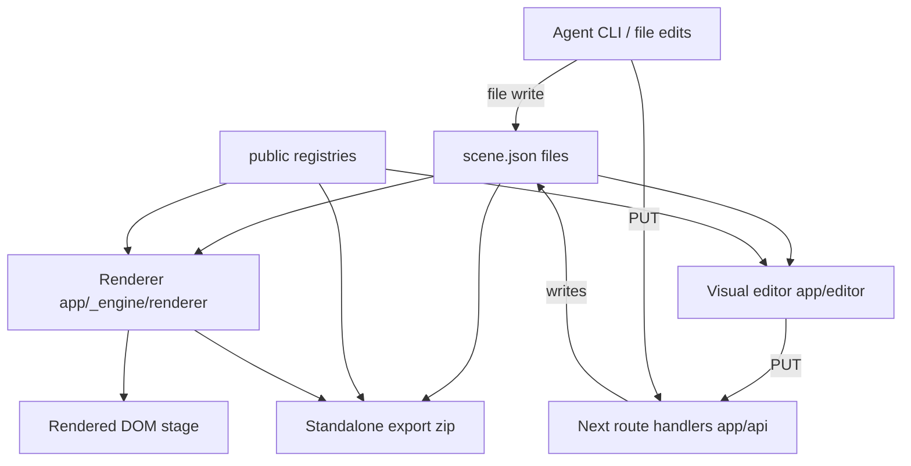

# Scene-Engine: System Architecture (L1)

The scene-engine is a Next.js app under `apps/scene-engine/`. It has three coordinated subsystems — a **plain-JS production renderer**, a **React/Zustand visual editor**, and **Next route handlers** for scene, asset, registry, font, and export operations — all operating on the same `scene.json` files and shared public registries.

---

## System Metaphor / Mental Model

Think of `scene.json` as the document and the renderer as a print engine. The editor and the agent are two different word processors that edit the document. The print engine doesn't care which produced the document; it only cares the document is valid.

The renderer itself has no framework or virtual DOM. It dispatches by string `type` to small renderer functions. React owns the page/editor shells, while Zustand owns editor state and mutations.

## High-Level Architecture

### The Big Picture

```
projects/<id>/scenes/<scene>/scene.json ── fetched ──> renderer ── DOM ──> stage
   ▲
   │ writes
   ├── visual editor (browser) ── PUT /api/scenes/{id}?project={project} ── Next route
   │
   └── agent (file I/O or API)
```



### Key Architectural Decisions

For the *why* behind these, see [Foundation/principles](../00-foundation/30-principles.md).

- **Framework-free renderer.** ES modules throughout. The renderer is small enough that adding a framework would dominate it.
- **String-keyed renderer registry** (`registerRenderer(type, fn)`). New layer types are an extension point: register a renderer, add an asset entry, done.
- **Zustand editor store.** Panels communicate through selectors and mutations rather than through each other directly.
- **Next route handlers.** The filesystem-backed APIs live under `app/api/`, so dev and production behavior share the same implementation.
- **Private engine folder.** Shared implementation code lives under `app/_engine/`, a private App Router folder targeted by the `@/*` alias.
- **Two registries, single merged map.** `public/assets/registry.json` (uploadable file containers — audio/image/video/glyph) and `public/modules/registry.json` (authored effects/components) are loaded in parallel and merged into one ID-keyed map. Scenes reference IDs; the registry holds the file pointer.

## File Tree

```
apps/scene-engine/
├── projects/<id>/              project manifests + scene definitions
├── public/                     static assets, modules, registries, fonts
├── app/
│   ├── page.tsx                dashboard
│   ├── projects/[projectId]/page.tsx project scene list
│   ├── scenes/[id]/page.tsx    scene preview
│   ├── editor/                 visual editor
│   ├── upload/                 upload page
│   ├── api/                    route handlers
│   └── _engine/                private shared renderer/store/lib/types/export code
└── package.json                Next scripts
```

```
docs/20-implementation/
├── 00-overview.md              (this file)
├── 10-renderer/                Production renderer + asset registry
├── 20-editor/                  Visual editor (3 panels, state, mutations)
├── 40-asset-pipeline/          Upload + swap routes, asset-types lib, /upload page
└── 99-appendix/                Setup, dev workflow, quick references
```

## Section Index

### [10-renderer/](10-renderer/00-overview.md)
**The print engine.** Loads scenes and the asset registry, dispatches each layer to a typed renderer, builds DOM. The only place that knows how a scene becomes pixels.

### [20-editor/](20-editor/00-overview.md)
**The word processor.** Three-panel browser app — canvas, hierarchy, inspector — sharing a small reactive store. Reads, mutates, saves, and exports `scene.json`.

### [40-asset-pipeline/](40-asset-pipeline/00-overview.md)
**The intake.** Standalone `/upload` page, the API routes that write files and mutate `public/assets/registry.json`, and the shared `asset-types` library used by both client and server.

### [99-appendix/](99-appendix/00-overview.md)
**The runbook.** How to start the dev server, the URLs that matter, where files live for each piece.

## Cross-Cutting Concerns

- **Scene data format**: see [System Design / Scene Data Model](../10-system-design/10-scene-data-model.md). The L4 file headers in the renderer reference back to that doc.
- **Asset registry shape**: see [System Design / Asset Registry](../10-system-design/20-asset-registry.md).
- **Failure modes**: see [System Design / Rendering Pipeline](../10-system-design/30-rendering-pipeline.md#failure-modes). Renderers warn-and-skip on missing assets/sub-layers; renderer dispatch throws on unregistered types.

## Related

- [Foundation](../00-foundation/00-overview.md) — purpose, mental model, principles.
- [System Design](../10-system-design/00-overview.md) — language-agnostic blueprint.
- [Appendix](99-appendix/00-overview.md) — setup, dev URLs, references.
- [`apps/scene-engine/CLAUDE.md`](../../apps/scene-engine/CLAUDE.md) — quick-start for agents touching the code.
- [`apps/scene-engine/agents.md`](../../apps/scene-engine/agents.md) — quick-start for agents authoring scenes.
