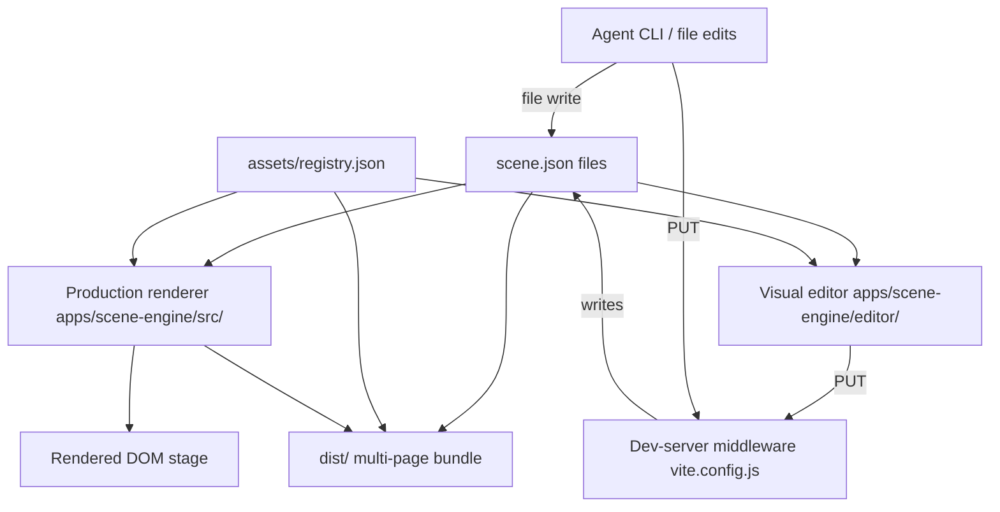

# Scene-Engine: System Architecture (L1)

The scene-engine is a vanilla-JS Vite app under `apps/scene-engine/`. It has three coordinated subsystems — a **production renderer**, a **visual editor**, and a **dev-server scene-save API** — all operating on the same `scene.json` files and a shared asset registry.

---

## System Metaphor / Mental Model

Think of `scene.json` as the document and the renderer as a print engine. The editor and the agent are two different word processors that edit the document. The print engine doesn't care which produced the document; it only cares the document is valid.

There is no framework, no state container library, no virtual DOM. The renderer dispatches by string `type` to one of five small renderer functions, and the editor uses `EventTarget` + `CustomEvent` for in-process pub/sub between panels.

## High-Level Architecture

### The Big Picture

```
scene.json ── fetched ──> renderer (dispatch by type) ── DOM ──> stage
   ▲                                                                  
   │ writes                                                           
   ├── visual editor (browser) ── PUT /api/scenes/{id} ── dev server  
   │                                                                  
   └── agent (file I/O or API)                                        
```



### Key Architectural Decisions

For the *why* behind these, see [Foundation/principles](../00-foundation/30-principles.md).

- **Vanilla JS, no framework.** ES modules throughout. The renderer is small enough that adding a framework would dominate it.
- **String-keyed renderer registry** (`registerRenderer(type, fn)`). New layer types are an extension point: register a renderer, add an asset entry, done.
- **Custom-event bus inside the editor** (`document.dispatchEvent` / `subscribe`). Avoids an external state library; panels are decoupled from each other.
- **Vite plugin for the scene-save API.** No separate Express/Fastify server. The dev server is the API server during development; production has no such API.
- **One Vite input per page (multi-page build).** Dashboard, editor, and one input per scene. Static `dist/` artifact, deployable anywhere.
- **Two registries, single merged map.** `public/assets/registry.json` (uploadable file containers — audio/image/video/glyph) and `public/modules/registry.json` (authored effects/components) are loaded in parallel and merged into one ID-keyed map. Scenes reference IDs; the registry holds the file pointer.

## File Tree

```
apps/scene-engine/
├── index.html                  dashboard
├── vite.config.js              dev server, scene-save API, build plugins
├── scripts/discover-scenes.js  scene discovery + per-scene HTML generation
├── scenes/<id>/scene.json      scene definitions
├── assets/                     registry + asset files (see scene-engine CLAUDE.md)
├── public/                     static assets passthrough
├── src/                        production renderer
│   ├── main.js
│   ├── styles/stage.css
│   └── renderer/               see 10-renderer/
└── editor/                     visual editor
    ├── index.html
    └── src/                    see 20-editor/
```

```
docs/20-implementation/
├── 00-overview.md              (this file)
├── 10-renderer/                Production renderer + asset registry
├── 20-editor/                  Visual editor (4 panels, state, mutations)
├── 30-dev-server/              Vite plugins — scene API and build copy
├── 40-asset-pipeline/          Upload + swap routes, asset-types lib, /upload page
└── 99-appendix/                Setup, dev workflow, quick references
```

## Section Index

### [10-renderer/](10-renderer/00-overview.md)
**The print engine.** Loads scenes and the asset registry, dispatches each layer to a typed renderer, builds DOM. The only place that knows how a scene becomes pixels.

### [20-editor/](20-editor/00-overview.md)
**The word processor.** Four-panel browser app — canvas, hierarchy, inspector, asset browser, toolbar — sharing a small reactive store. Reads, mutates, saves `scene.json`.

### [30-dev-server/](30-dev-server/00-overview.md)
**The plumber.** Vite plugins that expose the scene CRUD API in development and copy assets / scene JSON into `dist/` at build time.

### [40-asset-pipeline/](40-asset-pipeline/00-overview.md)
**The intake.** Standalone `/upload` page, the API routes that write files and mutate `assets/registry.json`, and the shared `asset-types` library used by both client and server.

### [99-appendix/](99-appendix/00-overview.md)
**The runbook.** How to start the dev server, the URLs that matter, where files live for each piece.

## Cross-Cutting Concerns

- **Scene data format**: see [System Design / Scene Data Model](../10-system-design/10-scene-data-model.md). The L4 file headers in the renderer reference back to that doc.
- **Asset registry shape**: see [System Design / Asset Registry](../10-system-design/20-asset-registry.md).
- **Failure modes**: see [System Design / Rendering Pipeline](../10-system-design/30-rendering-pipeline.md#failure-modes). Renderers warn-and-skip on missing assets/sub-layers; renderer dispatch throws on unregistered types.

## Related

- [Foundation](../00-foundation/00-overview.md) — purpose, mental model, principles.
- [System Design](../10-system-design/00-overview.md) — language-agnostic blueprint.
- [Appendix](99-appendix/00-overview.md) — setup, dev URLs, references.
- [`apps/scene-engine/CLAUDE.md`](../../apps/scene-engine/CLAUDE.md) — quick-start for agents touching the code.
- [`apps/scene-engine/agents.md`](../../apps/scene-engine/agents.md) — quick-start for agents authoring scenes.
